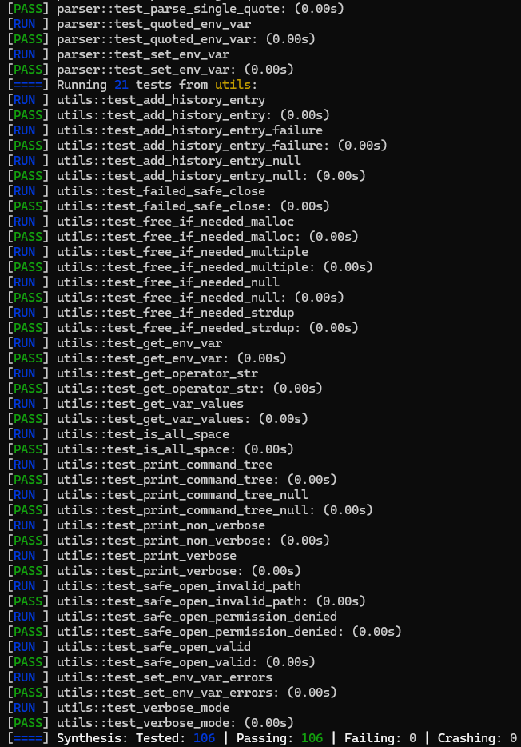

# WinAxShell - MiniShell project

- Axel Munch [🐍 GitHub](https://github.com/axelmunch)
- Winness Rakotozafy [🐧 GitHub](https://github.com/WRKT)

## Objectif

L'objectif de ce projet est de réaliser l'implémentation d'un interpréteur de commande "MiniShell" similaire à bash dans une version simplifiée. Au lancement, ce dernier doit pouvoir afficher un prompt en attente de la saisie d'une commande ou d'un sous-ensemble de commandes.

Les commandes sont lancées par des processus fils laissant au père le rôle d'interpréteur. Ce dernier doit attendre la fin du/des processus fils pour afficher le résultat d'exécution du/des commande(s) soumises. Certaines commandes et variables devront être internes (fonctionnalités built-in), c'est-à-dire, directement prises en compte par le code.

# Fonctionnalités

> [!IMPORTANT]  
> L'utilisation des opérateurs requiert l'insertion d'espaces entre les commandes. Voir les différents exemples ci-dessous.

- Exécution de commandes simples : `ls -l` `ps` `who`
- Opérateurs de contrôle : `||` `&&`
- Redirection de flux simples : `|` `>` `<` `>>` `<<`
- Exécution en arrière-plan : `ls & ; ps`
- Développement de commandes internes :  `cd` `pwd` `ls_custom` `echo` `alias` `unalias`
- Historique des actions (dans le fichier `~/.winaxshell_history`)
- Utilisation en mode batch : `./bin/winaxshell -c "ls"`
- Création de variables d'environnement : `var=value ; echo $var`
- Prise en charge d'alias : `alias ll="ls -l"`
- Mode verbeux pour affichage du debug et de l'arbre de parsing `./bin/winaxshell -v`
- Intégration continue avec lancement des tests `make tests`

## Ressources

[Lien vers la documentation]()

[Lien vers le rapport de couverture]()

## Installation

Voici les paquets nécessaires afin d'utiliser les différentes commandes Makefile du projet :
- `build-essential`
- `doxygen`
- `graphviz`
- `valgrind`
- `expect`
- `libcriterion-dev`
- `lcov`
- `cowsay` (for demo)

## Utilisation

`make` : Compilation du projet

`make run` / `./bin/winaxshell` : Démarrage du shell interactif

`./bin/winaxshell -v` : Démarrage du shell en mode verbeux

`./bin/winaxshell -c "ls -l"` : Lancement du shell en mode batch

`make tests` : Exécution des tests sur le projet

`make demo` : Lancement de la démonstration en direct

`make doc` : Génération de la documentation

`make gcov` : Génération du rapport de couverture

`make memtest` : Recherche de fuites de mémoire en mode interactif avec Valgrind

## Démonstration

`make tests`



`make demo`

[Shell demo](https://github.com/user-attachments/assets/e6930947-2480-4277-bb1e-a24ffb318f78)

## Exemples

```sh
make run
```

```sh
a="Hello" b="World" ; echo '$a $b'
```

```sh
ls_custom && echo && ls -al
```

```sh
cd ~
cat .winaxshell_history
cd -
```

```sh
cat < Makefile > mocks/output.txt && echo 'Redirect succeeded' || echo 'Failed to redirect' && echo "Test redirection command OK" && cat mocks/output.txt
```

```sh
exit
```

# The end!

```
    .................      . .:.:-.# ...........................................
      ...............  @*%#+:-:=#@@* .........................................
  .    ...............  @@@#+@@@%**@@  .....................................
.@@%=    ............. .@%=*#@@@@@@#@  ............................           @#
 =*%@@@@    .......... @@%@@%@+=*-%@@@  ........................     -@@@@@@@###
 ##%#+:#@@    ........ *@@%%@@**@+=*@@. ....................    +@#@@%###%%%%@%*
 ++-::+@++@@:  ....... . @%++@@@@@**%@@  .................  .-##%############%%*
 +=-=*@..:-@@   .......  :@@+**#%%+*%@@. ...............   :###%##%########%#%%*
.++=+*=-**@@@@-  .......  .@%*%%@%*%@@@. ............   :%###@##%####%##%####%%*
 +++*###=-+.=-*   .......  @@@-%%+*#@@%   ......      .%##%@%%@%########%#####%*
 =+#+=+=:=*@@-%@ .  .....  .@. @#*%@%@#    ...    @@@@@@########%@#%########%#%*
 #@#+*+=+@@%..:@@@    ....  @ #@**###@@@@    . =-@@#****=:+###%##@##%##########*
 %%###-#@%=  #@@**@@#    .  .@%#***@#@*#@@@    .@%**+:.=-=-*##%@%@##%%%%##%####*
 @%+=++@*  .@@*:.=:=+@@   .@@@@@%#*##@+**@@@-  @@#+-:+####*+%##%%@%#%%%%%%%%%%%*
.%**++@=..=@#.:.===- .@@ . @%#*######@**#=+@@@@%#%@%%%%##%@@@%###@@#%%%%%%%%%%%*
.%@*+#*- *@#-::===-..@@@@@@@%#*#+*##%@**#*#@+#*==-#@@@@@@@+..%#%@@@##%%%%%%%%%%*
.%%@##  @@#=:====:..@@@%*@@+***#%%%#@%##%**##*+@@%*:.-++*+++=*#%@@@##%%%#%#%%%%*
-@#-:+@@@#:--#+-. @@%%%@#=%%*+*@@%#@@###*#%***+*#@-*@@*#=:+*#@@@@@@@%%%%%%%%%%%*
%@@@@@@+=+#@*-. @@@@%%##@@@*==*@@#@@@#%%%##*###%=-.-=%%*+*%@@@@@   .@%%%%%%%%%%*
:@@@@@@@@#*:.=@@@@%%%%%##%#%%#@@%@@@%#%%%%%%@@#=::+%%%%+@@@@@-     .@%%%%%%%%%%*
+@@@@@@@@-@@@@@@@@@@%%%%###%#@@@@@@@@@@@%%@@@*=+#%@@@@@@@@@    ...  @%@%%%%%%%%*
+@@%%@%@@ .@@@@@@@@@@@@@@@@@#%@@@@@  @@%%%%*+#@@@@@@@@%      .....  @@@@%%%%%%%*
-:..++=%     -##**#####*****#**+=+%   *+++++**-             ......  =#**********
```
